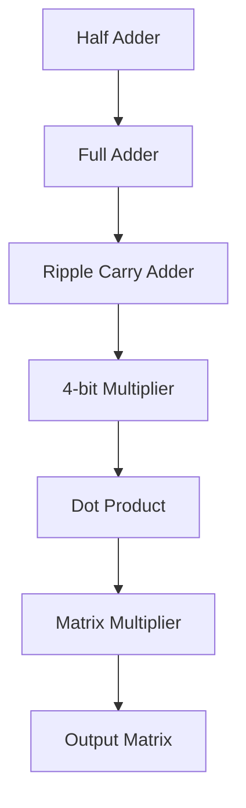
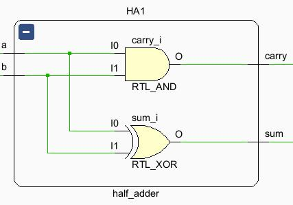

# FPGA-5x5-Matrix-Multiplier
Gate level verilog implementation of 4-bit 5x5 Matrix multiplier for FPGA deployment by structural approach. From half adder to Matrix Multiplier - this project is my first hands-on verilog HDL project.

# Overview

This project explores the implementation of matrix multiplication using structural approach rather than relying entirely on high-level arithmetic operators. The design is being developed and verified using Xilinx Vivado for FPGA implementation.

# Target FPGA Device :

|Parameter|Value|
|---|---|
|FPGA Part| xc7z020clg484-1 |
|Family| Zynq-7000 SoC (XC7Z020) |
|Package|	CLG484 (484-ball BGA) |
|Speed Grade|	-1 (standard) |
|Board| ZedBoard |

# Architecture

The arithmetic datapath is constructed progressively:

The lower-level arithmetic blocks are used as building blocks for higher-level modules.

# Module Wise Description

## Half Adder
A simple half adder that will add two bits producing 1 carry and 1 sum bit.
### Architecture
|Parameter|Value|
|---|---|
|Inputs| a,b |
|Outputs| carry,sum |
|I/O count| 2:2 |
### Schematic

[half_adder.v](Verilog_files/half_adder.v)

