# FPGA-5x5-Matrix-Multiplier
Gate level verilog implementation of 4-bit 5x5 Matrix multiplier for FPGA deployment by structural approach. From half adder to Matrix Multiplier - this project is my first hands-on verilog HDL project.

# Overview

This project explores the implementation of matrix multiplication using structural approach rather than relying entirely on high-level arithmetic operators. The design is being developed and verified using Xilinx Vivado for FPGA implementation.

# Target FPGA Device :

|Parameter|Value|
|---|---|
|FPGA Part| xc7z020clg484-1 |
|Family| Zynq-7000 SoC (XC7Z020) |
|Package|	CLG484 (484-ball BGA) |
|Speed Grade|	-1 (standard) |
|Board| ZedBoard |

# Architecture

The arithmetic datapath is constructed progressively:

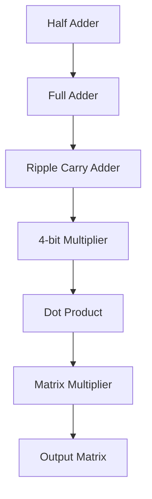
The lower-level arithmetic blocks are used as building blocks for higher-level modules.

# Module Wise Description

## Half Adder
A simple half adder that will add two bits producing 1 carry and 1 sum bit.

### Architecture:
|Parameter|Value|
|---|---|
|Inputs| a,b |
|Outputs| carry,sum |
|I/O count| 2:2 |

### Module Code :
[half_adder.v](Verilog_files/Module_codes/half_adder.v)

### Testbench Code :
[tb_half_adder.v](Verilog_files/Testbench_codes/tb_half_adder.v)

### Schematic :
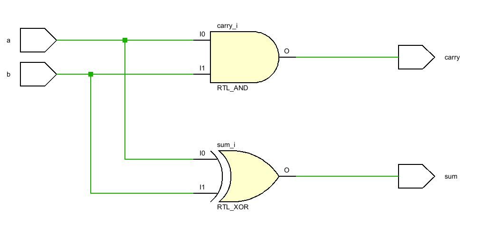

### Synthesized Schematic :
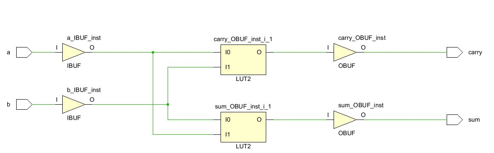

### Output :
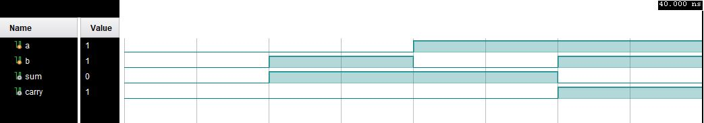

-----------------------------------------------------------------------------------------------------------------------------------------------------------------------------------

## Full Adder
A simple full adder that will add two 2-bits number producing 1 carry and 1 sum bit. It can also take carry from previous adder ie i/p c.
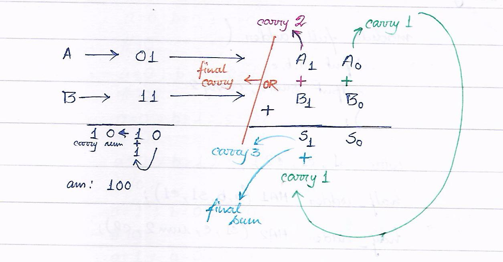

### Architecture:
|Parameter|Value|
|---|---|
|Inputs| a,b,c |
|Outputs| carry,sum |
|I/O count| 3:2 |

### Module Code :
[full_adder.v](Verilog_files/Module_codes/full_adder.v)

### Testbench Code :
[tb_full_adder.v](Verilog_files/Testbench_codes/tb_full_adder.v)

### Schematic :
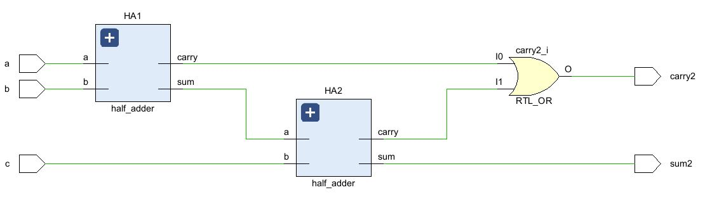

### Synthesized Schematic :
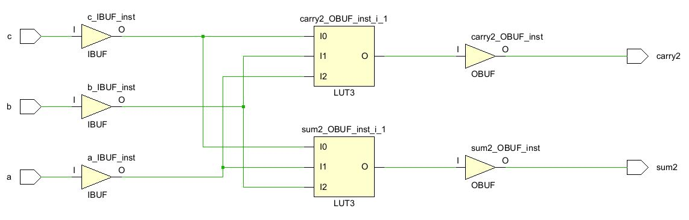

### Output :
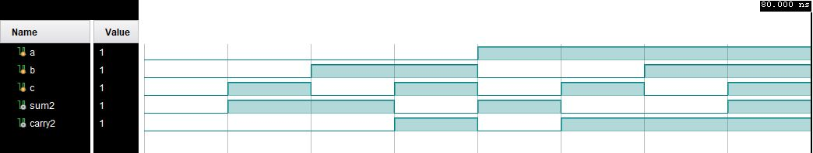

-----------------------------------------------------------------------------------------------------------------------------------------------------------------------------------

## 4-bit Ripple Carry Adder
A 4-bit Ripple Carry Adder consists of 4 full adder connected in series that will add two 4-bits number producing 1 carry and 4 sum bit. It can also take carry from previous adder ie i/p cin.

### Architecture:
|Parameter|Value|
|---|---|
|Inputs| A0,B0,A1,B1,A2,B2,A3,B3,cin |
|Outputs| S0,S1,S2,S3,c3 |
|I/O count| 9:5 |

### Module Code :
[ripple_carry_adder.v](Verilog_files/Module_codes/ripple_carry_adder.v)

### Testbench Code :
[tb_ripple_carry_adder.v](Verilog_files/Testbench_codes/tb_ripple_carry_adder.v)

### Schematic :
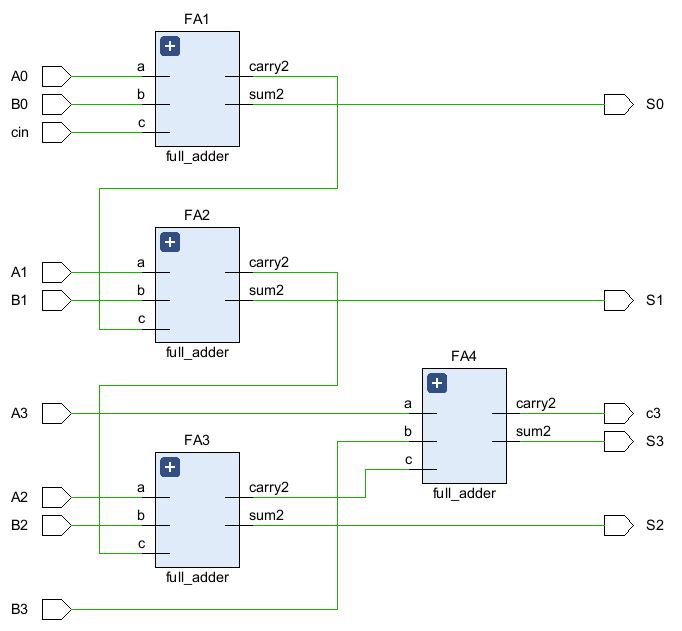

### Synthesized Schematic :
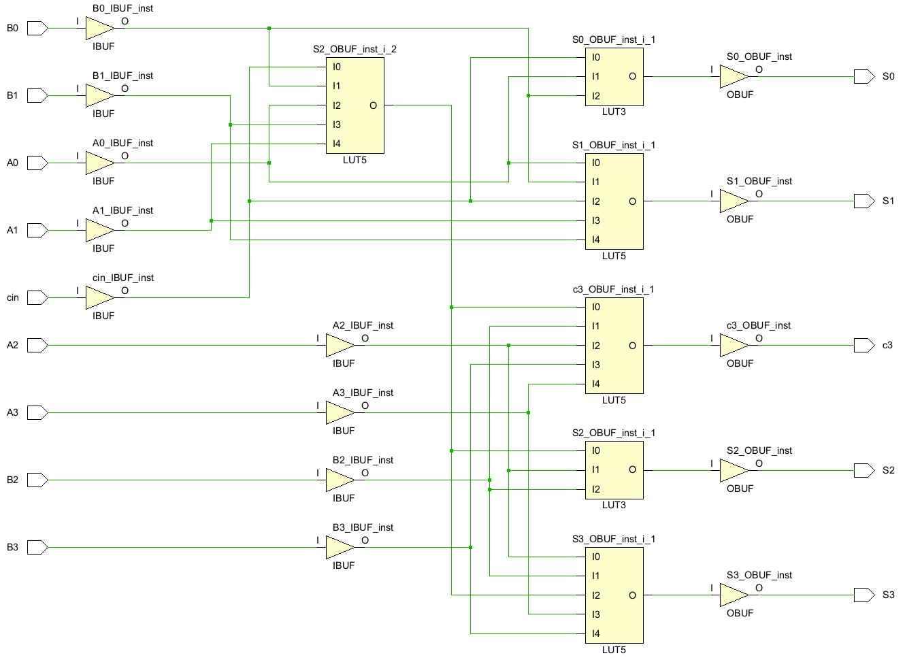

### Output :
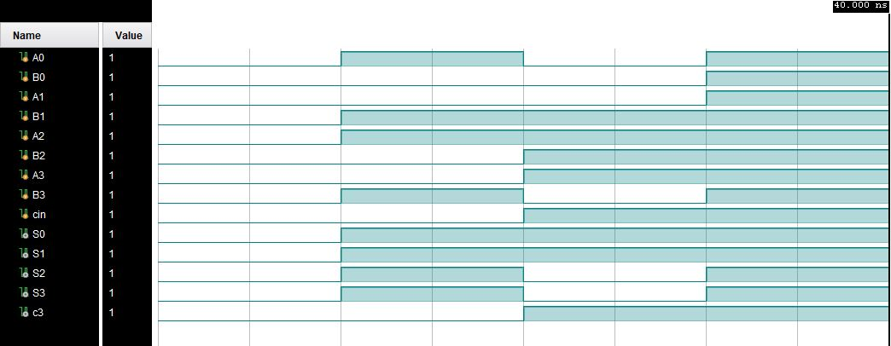

